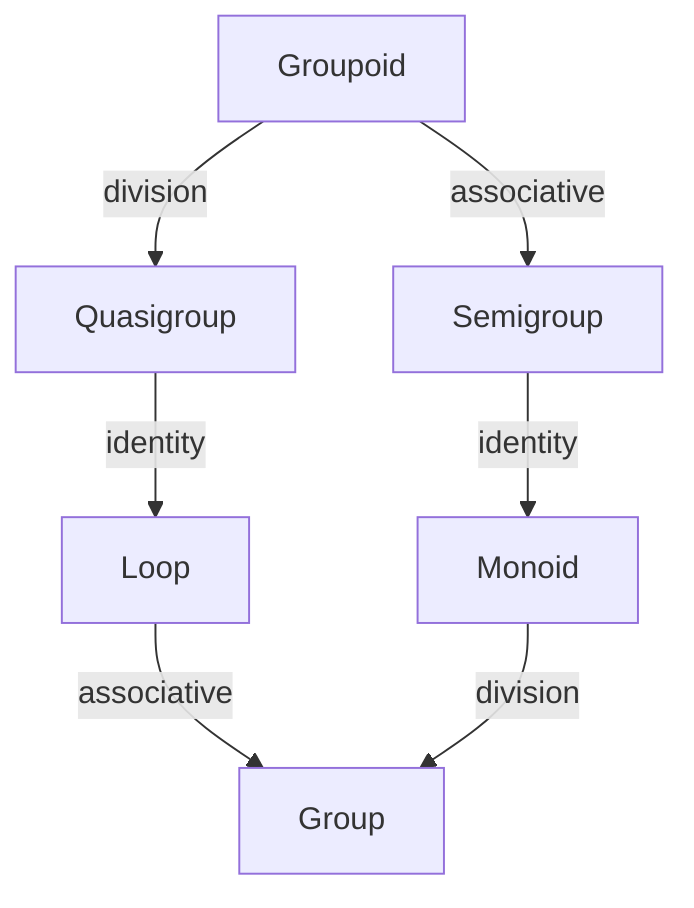

# Abstract-Algebras
Mathematica notebooks about abstract algebra: what kinds, how many for each size, etc.

What is abstract algebra? First note that mathematicians love abstractions, taking properties and generalizing them. Abstract algebra uses a generalization of the features of operations on numbers that many of us had learned about. Properties like being commutative and associative, being independent of order and grouping, true of addition and multiplication though not of subtraction or division.

The functions or operators are from some set (the domain set) to the same set, usually a finite set in most of the examples that I will consider here. Every one will be over all the elements in that set, while they need not return every element in that set. Much of these notebooks' content is for counting every possible function with some properties for some size of set.

A major resource used for the numbers and formulas in many of these notebooks is [The On-Line Encyclopedia of Integer Sequences® (OEIS®)](https://oeis.org/)

# One function

## Unary functions
Functions of one variable - Notebook: `Unary Functions.nb`

For a finite domain set, repeated application of such a function will converge onto a limit cycle of an endlessly repeating sequence, a cycle which can have one member, the fixed point.

## Binary functions
Functions of two variables - Notebook: `Groupoids.nb`

Called groupoids or magmas.

They have a variety of possible algebraic properties. For operation *:
* Commutative: b * a = a * b
* Associative: (a * b) * c = a * (b * c)
* Left, right, two-sided (plain) identity e: e * a = a, a * e = a, both
* Left, right, two-sided (plain) zero, absorber, annihilator z: z * a = z, a * z = z, both
* Ideals generalize zeros to sets
* Division: for every a, b, there exists a unique x, y satisfying a * x = y * a = b. x and y can be either equal or distnct.

Many familiar operations satisfy some of these properties. These ones are all commutative and associative:
* Addition: identity: 0
* Multiplication: identity: 1, zero: 0
* Minimum: identity: max of domain, zero: min of domain
* Maximum: identity: min of domain, zero: max of domain
* Boolean and: identity: true, zero: false
* Boolean or: identity: false, zero: true
* Set intersection: identity: universal set of domain, zero: empty set
* Set union: identity: empty set, zero: universal set of domain

Matrix multiplication is associative without being commutative. Subtraction and division are neither commutative nor associative.

Here are groupoids with some of these features:
* Semigroup: associative
* Quasigroup: division
* Loop: division, identity
* Monoid: associative, identity
* Group: associative, identity, division (gives inverses)

## Ternary functions
Functions of three variables - Notebook: `Pure Ternary Operators.nb`

That notebook finds all pure ternary functions f(a,b,c), pure meaning not some combination of binary functions, like f1(f2(a,b),c). It only finds them for a set with size 2, because the number of them grows large **very** fast. For domain size n and number of arguments (input values) m,

number (labeled) = nnm

| Size | 1 | 2 | 3 | 4 | 5 | 6 |
| --- | --- | --- | --- | --- | --- | --- |
| 1 | 1 | 1 | 1 | 1 | 1 | 1 |
| 2 | 4 | 16 | 256 | 65536 | 4294967296 |
| 3 | 27 | 19683 | 7625597484987 |
| 4 | 256 | 4294967296 |
| 5 | 3125 |

I find this table of results
| What | Lbld | Unlb |
| --- | --- | --- |
| Unary | 4 | 3 |
| Binary | 16 | 10 |
| Ternary | 256 | 136 |
| From Binary | 152 | 80 |
| Pure Ternary | 104 | 56 |

Lbld = labeled, Unlb = unlabeled (isomorphic sets)

## N-ary algebras
Notebook: `N-ary Algebras.nb`

These are algebras with a single operation, a function that takes some arbitary number of arguments. Surprising as it might seem, there is a general formula for the number of non-isomorphic, unlabeled algebras for some number of arguments and some size of domain set, though it is rather complicated.

# More than one function

## Lattices
Notebook: `Lattices.nb`

An abstract-algebra lattice has two operators, usually called meet and join (mt, jn). Over the lattice's domain, each one is a kind of semigroup called a semilattice: associative, commutative and idempotent (a*a = a). Meet and join are related by

a mt b = a (equivalent) a jn b = b

Both operators define partial orderings, in opposite directions. One can define a dual lattice by renaming meet and join after the other one.

Some lattices (domain, meet, join) are:
* (numbers, minimum, maximum)
* (positive integers, gcd, lcm)
* (sets, intersection, union)
* Boolean: ({true, false}, and, or)

gcd = greatest common divisor, lcm = least common multiple

These lattices are all distributive, meet being distributive over join and vice versa, though a lattice need not be distributive.

## Rings
Notebook: `Rings.nb`

An abstract-algebra ring has two operators, usually called addition + and multiplication * in analogy with what they generalize: addition and multiplication over numbers. Addition forms an abelian (commutative) group over the ring's domain, while multiplication forms a semigroup over that domain. Multiplication is distributive over addition:
* a * (b + c) = (a * b) + (a * c)
* (a + b) * c = (a * c) + (b * c)

Some rings (domain, addition, multiplication) are:
* (numbers, addition, multiplication)
* Boolean: ({true, false}, exclusive or, and)

Also works for polynomials and matrices.

### Rings with nonabelian addition groups
Notebook: `Rings with Nonabelian Addition Groups.nb`

This is a kind of near-ring where the addition group is made nonabelian. The notebook contains some results and worked examples. A notable result is that all products of elements are abelian under addition.

### Galois fields and rings
Notebook: `Galois Fields and Rings.nb`

In abstract algebra, a field is a ring where multiplication is a group over all the domain but the additive identity, 0, the zero of this operation. All the finite fields are known: Galois fields GF(pn) for prime p and power n, unique for each order. GF(p) is easy: Z(p). For higher prime powers, the fields can be implemented as polynomials in GF(p) with multiplication having the remainder after dividing by a "primitive polynomial" of degree n. This notebook calculates those polynomials.

It also does so for "Galois rings", which are related. Instead of coefficients in Z(p), it has them in Z(pm) for some power m.

## Cayley-Dickson Construction
Notebook: `Cayley-Dickson Construction.nb`

This construction finds a sequence of algebras from real numbers, though it can also work with other fields, like rational numbers or finite fields.

Each algebra in this sequence has addition, multiplication, and conjugation operations. Addition is done component by component, conjugation generalizes complex conjugation, and multiplication is rather complicated, defined in recursive fashion, going down the algebra sequence. The algebras defined in this sequence lose properties as one goes:
* Real numbers
* Complex numbers - not self-conjugate
* Quaternions - not commutative
* Octonions - only partially associative ("alternative")
* Sedenions and higher ones - only power-associative, has nontrivial divisors of zero

Inspired by [Octonions](https://math.ucr.edu/home/baez/octonions/) by John Baez of UCR

# Utilities

## Partition transform
Notebook: `Partition Transform.nb`

Many abstract-algebra entities can be decomposed into direct products of smaller ones; those ones are "reducible". Those that cannot are "irreducible". To find total counts from counts of irreducible ones, it is necessary to use a partition transform, one of Euler's transforms. For irreducible numbers n1, n2, n3, n4, ... and total numbers nt1, nt2, nt3, nt4, ...
* nt1 = n1
* nt2 = n2 + n1{2}
* nt3 = n3 + n2 * n1 + n1{3}
* nt4 = n4 + n3 * n1 + n2{2} + n2 * n1{2} + n1{4} 
* ...

The powers are symmetrized: n{m} = n * (n+1) * ... * (n+m-1) / m!

This transform is the partition transform, one of Euler's transforms. It can be inverted to find the irreducible counts from the total counts.

The algorithm uses Möbius (Moebius) inversion, also implemented in this notebook:
* a(n) = sum over d evenly dividing n, of b(d)
* b(n) = sum over d evenly dividing n, of mu(n/d) * a(d)
where mu(n) is 1 if n = 1, (-1)m for n having m distinct prime factors, and 0 for n having a repeated prime factor.
